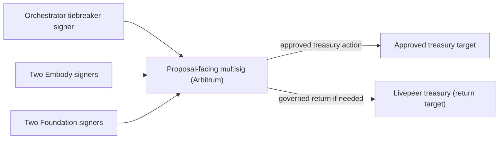
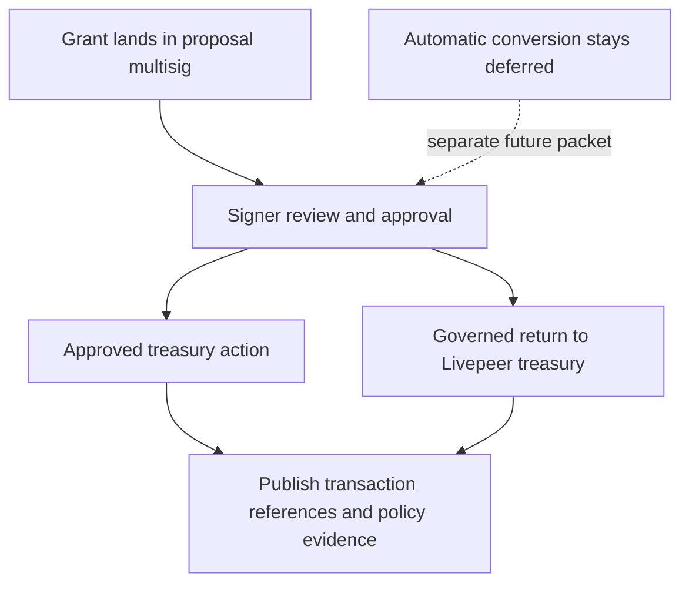

# Livepeer Grant Wallet Governance v0 Design Contract + Ledgers Packet

Date: 2026-03-09  
Lane: `features/livepeer-grant-wallet-governance-v0`  
Status: design truth revised, implementation not started

## Done / Not Done / Decisions

### Done
1. The intended v1 treasury-security shape is defined:
   - deployment chain is Arbitrum
   - one proposal-facing multisig receives the grant
   - the intended signer composition is one orchestrator tiebreaker signer, two Embody team signers, and two Foundation signers
   - the multisig operates at a 3/5 threshold
   - treasury actions stay under the governed multisig path
   - if funds need to be returned, the remaining grant balance can be sent back to the Livepeer treasury through governed action
2. The packet truth is explicit:
   - this is design truth / intent contract
   - this is not legal text
   - this is not production code
3. Older alternatives are retained as historical context only:
   - timelock-centric custody
   - automatic treasury conversion / return logic
4. Automatic conversion / auto-swap logic remains out of v1.

### Not Done
1. Final signer addresses are not listed in this public appendix.
2. The exact return conditions for sending remaining grant funds back to the treasury are not finalized.
3. No production contracts, deployment scripts, audit package, or runbooks are locked by this packet.

### Decisions
1. The deployment chain for v1 is Arbitrum.
2. Treasury custody stays on a proposal-facing multisig.
3. The intended signer composition is one orchestrator tiebreaker signer, two Embody team signers, and two Foundation signers.
4. The multisig threshold is 3/5.
5. Treasury actions follow the governed multisig path.
6. If funds need to be returned, they return to the Livepeer treasury through governed action.
7. Automatic conversion / auto-swap stays out of v1 and remains a deferred, higher-risk lane.

## Design Contract

### 1) Decision

Adopt a simple v1 governance pattern on Arbitrum for the Livepeer proposal treasury-governance lane:

1. grant funds first land in a proposal-facing multisig
2. the signer composition is one orchestrator tiebreaker signer, two Embody team signers, and two Foundation signers
3. treasury actions require 3/5 multisig approval under a documented operating policy
4. if a return action is triggered, the remaining grant balance can be returned to the Livepeer treasury through the same governance path
5. signer addresses remain implementation truth and are not listed in this public appendix

This packet is design truth only. It is not legal text, not a grant agreement, and not production code.

### 1A) Standardized Funding / Return Flow

1. Receive the grant on Arbitrum into the proposal-facing multisig.
2. Use the documented signer policy to approve treasury actions tied to milestone outputs and reporting.
3. If a governed return action is required, return the remaining balance to the Livepeer treasury.
4. Publish transaction references and signer evidence for any treasury or return action that occurs.

### 2) Success Tests (Acceptance Criteria)

1. Grant funds land first in the multisig, not directly on an operator EOA.
2. The deployed signer set matches the intended composition in this packet.
3. No proposal-family document still claims timelock custody or timelock delay as a v1 fact.
4. The return-to-treasury path is documented and reviewable before it is needed.
5. v1 does not depend on automatic conversion / auto-swap logic.
6. The signer addresses can remain unpublished in this public appendix, but the operating threshold must be explicit.

### 3) Constraints + Non-Goals

Constraints:

1. Keep the design operationally simple enough to explain and verify.
2. Keep treasury control under explicit human approval.
3. Separate treasury governance from runtime and operator control.
4. Treat Arbitrum as locked design truth; signer addresses and execution details remain follow-on configuration outside this public appendix.

Non-goals:

1. Writing final legal / grant language.
2. Claiming production-readiness or audit completion.
3. Shipping automatic treasury swaps, conversions, or strategy automation in v1.
4. Pretending the return conditions are already fully specified if they are not.

### 4) System Boundary + Trust Boundary

System boundary:

1. proposal-facing multisig
2. signer lanes
3. treasury recipients or destination addresses
4. Livepeer treasury return target
5. any offchain execution lane used for a governed return action

Trust boundary:

1. grant receipt enters through the proposal-facing multisig on Arbitrum
2. treasury actions require 3/5 approval from the signer set
3. return actions, if triggered, use the same governed multisig path
4. runtime and control-plane operations remain outside the treasury approval boundary

Outside the boundary:

1. legal grant obligations
2. exchange integrations or automatic treasury bots
3. offchain accounting policy
4. future treasury automation modules

### 5) Components + Responsibilities

1. Proposal-facing multisig:
   - is the receipt address for grant funds on Arbitrum
   - is the treasury-governance control surface for v1
   - executes approved treasury actions under the signer policy
   - may authorize return of remaining grant funds to the Livepeer treasury if needed
2. Orchestrator tiebreaker signer:
   - is the independent orchestrator-side signer lane
   - provides a network-facing counterweight in the signer set
3. Embody team signers:
   - provide two implementation-side signer lanes
   - co-approve treasury actions under the multisig policy
4. Foundation signers:
   - provide two foundation-side signer lanes
   - represent the foundation-side review lane
   - participate in review and approval through the multisig policy
5. Recipient / return targets:
   - receive approved treasury transfers
   - include the Livepeer treasury if a governed return action is used

### 6) Invariants (Must Never Break)

1. This packet is design truth only and must not be mistaken for deployed code or legal text.
2. The deployment chain for this packet is Arbitrum.
3. Grant funds first land in a proposal-facing multisig, not on an operator EOA.
4. Treasury actions require the governed multisig path.
5. If a return action is used, the funds return to the Livepeer treasury.
6. Automatic conversion / auto-swap does not exist in v1.
7. The signer composition in this packet must match the signer composition claimed elsewhere in the proposal family.

### 7) Failure Model + Observability

Failure model:

1. The deployed signer set does not match the intended composition:
   - the packet truth and implementation truth diverge immediately
2. Docs still claim timelock custody after the design changed:
   - reviewers are reading contradictory governance stories
3. The threshold or operating policy stays implicit:
   - accountability and reviewability collapse
4. A return path is claimed but not actually executable:
   - the safeguard is rhetorical instead of operational
5. Automatic treasury conversion sneaks into v1:
   - the risk surface expands beyond the locked design

Observability:

1. multisig deployment reference
2. signer registry / signer-address publication if and when those addresses are made public
3. treasury transaction references
4. any return-to-treasury transaction references
5. published operating policy and return-policy docs

### 8) Top Risks + Fastest Falsification Tests

| Risk | Fastest falsification test | Pass threshold |
|---|---|---|
| The multisig signer composition in practice diverges from the proposal packet | inspect the deployed signer registry and compare it to this packet | signer roles and counts match the documented composition |
| Threshold ambiguity leaves the treasury model under-specified | review whether the threshold is published before deployment | threshold is explicit before implementation starts |
| The proposal still carries stale timelock language | scan the packet family for timelock claims | no v1 doc describes a timelock as the custody model |
| The claimed treasury-return safeguard is not operationally defined | inspect the published return-policy and execution notes | reviewers can explain when and how a return would happen |

## Interface Ledger

| Component | Interface | Protocol/Method | Contract | Ownership | Security boundary |
|---|---|---|---|---|---|
| Proposal multisig | receive grant / approve treasury action | Safe transaction | Arbitrum multisig; 3/5 threshold; signer composition defined in this packet | Treasury / oversight lanes | treasury custody boundary |
| Signer lanes | approve or reject treasury action | Safe signature flow | one orchestrator tiebreaker lane, two Embody lanes, two Foundation lanes | Signer holders | approval boundary |
| Recipient target | receive approved payout | onchain transfer / contract call | destination receives funds only after governed multisig approval | Program operations | external destination boundary |
| Livepeer treasury return target | receive returned balance | onchain transfer | used only if a governed return action is triggered | Treasury / oversight lanes | return boundary |

## Risk Ledger

| Assumption | Impact | Uncertainty | Cheapest falsification test | Pass/Fail threshold | Date | Result | Decision update |
|---|---|---|---|---|---|---|---|
| Arbitrum is the intended v1 deployment chain | Medium | Low | confirm packet and proposal text both reference Arbitrum consistently | all v1-facing docs name Arbitrum with no competing chain target | 2026-03-09 | locked | treat other chains as out-of-scope unless a versioned revision replaces this packet |
| The proposal-facing multisig is sufficient for v1 treasury governance | High | Medium | review the expected treasury actions against a multisig-only path | no required v1 action depends on a separate timelock | 2026-03-09 | pending | if fail, redesign before deployment |
| The signer composition is a credible balance for v1 | High | Medium | owner review against accountability and availability goals | explicit owner acceptance of the signer composition | 2026-03-09 | pending | if fail, revise signer composition before deployment |
| Manual governed return to the treasury is safer than automatic conversion logic in v1 | High | Low | check whether any core requirement depends on automation | no core v1 security requirement depends on automatic conversion | 2026-03-09 | pending | keep automation deferred unless a hard requirement appears |

## Decision Ledger

| Decision | Options considered | Choice | Trade-offs accepted | Revisit trigger |
|---|---|---|---|---|
| Deployment chain | Arbitrum; other EVM chains | Arbitrum | chain-specific addresses still need to be assigned later | revisit only by explicit versioned revision |
| Treasury custody path | timelock handoff; proposal-facing multisig | proposal-facing multisig | simpler custody path, more emphasis on signer policy and threshold clarity | revisit only if grant mechanics force a different path |
| Signer composition | smaller bootstrap set; broader multisig set | one orchestrator tiebreaker signer, two Embody signers, two Foundation signers | signer addresses remain outside this public appendix | revisit only by explicit versioned revision |
| Threshold | 2/3, 3/5, broader threshold set | 3/5 | balances operational movement with review diversity | revisit only by explicit versioned revision |
| Return model | automatic conversion; manual governed return | manual governed return | less automation, lower attack surface, more reliance on signer process | revisit in a separate higher-risk packet |
| Historical alternatives | keep timelock model active; retain as explored history only | retain as explored history only | less decisional sprawl in v1 | revisit only by explicit versioned revision |

## Reality Notes

1. This packet is design truth only for the intended Livepeer proposal treasury-governance feature.
2. This packet is not legal text and not production code.
3. Arbitrum is the locked v1 chain for this packet.
4. Treasury custody remains on a proposal-facing multisig.
5. If a return action is triggered, remaining grant funds return to the Livepeer treasury through governed multisig action.
6. Automatic conversion / auto-swap remains intentionally deferred because it increases risk and is not required for the v1 governance objective.
7. Open questions still blocking deployment truth:
   - the final signer addresses
   - the exact return conditions and execution policy

## Mermaid Architecture Diagram

## Mermaid Control-Loop Diagram

