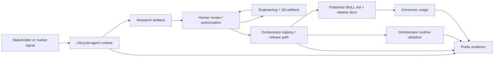

# Livepeer Proposal VF4 Technical Architecture

This document explains the proposed system in plain language and leaves the treasury mechanics to the separate [wallet governance packet](../livepeer-grant-wallet-governance-v0/2026-03-07-contract-ledgers-packet.md).

Related docs:

- [Roadmap and deliverables](ROADMAP_AND_DELIVERABLES.md)
- [Financial plan and governance](FINANCIAL_PLAN_AND_GOVERNANCE.md)
- [Wallet governance packet](../livepeer-grant-wallet-governance-v0/2026-03-07-contract-ledgers-packet.md)

## System Goal

WEAVE is designed to give Livepeer a public path from stakeholder signal to live workload execution. Its system goal is to coordinate the full workload lifecycle: research, engineering, QA, release, maintenance, distribution, and the evidence needed to judge demand.

For v1, the first proving lane is embodied avatar workloads. The architecture is still broader than that first lane. Its job is to show how Livepeer can move from intent to released workload through a repeatable public pipeline rather than through fragmented manual handoffs.

Design goals:

1. automate the workload lifecycle and the handoff between stages
2. keep human review and authorization at stage boundaries
3. create a reusable release and distribution path for orchestrators and consumers
4. make progress legible through public artifacts, usage evidence, release evidence, and governance evidence

## What WEAVE Coordinates

WEAVE is a decentralized, agent-operated Public Workload Pipeline for Livepeer. It operates outside orchestrator runtimes and coordinates workload creation and improvement across four connected planes:

1. **Signal and steering plane**  
   Livepeer stakeholders, operators, consumers, and market signals surface opportunities, provide steering, and review outputs.

2. **Lifecycle-agent runtime**  
   Agents perform bounded work across research, engineering, QA, release preparation, and distribution.

3. **Release and distribution plane**  
   Public artifacts, workload registry updates, `SKILL.md` publication, and consumer-facing release surfaces are produced here.

4. **Orchestrator/runtime plane**  
   Orchestrators adopt released workloads and run them on the actual runtime infrastructure.

The key architectural point is that WEAVE coordinates the path into the runtime while the runtime remains the execution plane.

## Core Actors

### Livepeer stakeholders / intent providers

These actors submit workload intent, propose changes, review outputs, and steer priorities. In some flows, the original proposer remains the primary reviewer. In governance-led flows, review can follow broader network guidance.

### Lifecycle agents

These agents operate the workload lifecycle across research, engineering, QA, release preparation, and distribution. They can prepare work, publish artifacts, and request review, but they do not self-authorize stage completion.

### Human reviewers / authorizers

These actors approve or reject lifecycle-stage completion. They can be the original proposer, designated reviewers, or governance-recognized authorizers. Human authorization remains mandatory at the stage boundary.

### Orchestrator operators

These are the infrastructure owners running workloads on Livepeer-compatible hardware. They adopt released workloads through the registry / rollout path and remain in control at the infrastructure boundary.

### Consumers

These are developers or AI agents using a released workload through a public contract such as `SKILL.md`. They should not need operator-level knowledge or direct host access.

### Treasury / governance roles

These roles manage funding custody and treasury governance. They are specified in the separate [wallet governance packet](../livepeer-grant-wallet-governance-v0/2026-03-07-contract-ledgers-packet.md), not here.

## Lifecycle-Agent Runtime

The lifecycle-agent runtime is WEAVE's operating layer. It is responsible for moving an approved intent through the workload lifecycle.

Core responsibilities:

1. ingest and interpret stakeholder intent
2. open a public work record for the proposed workload or update
3. perform research on demand, tooling, and feasibility
4. engineer or update the workload inside bounded environments
5. run QA, package release artifacts, and prepare rollout materials
6. publish stage outputs and request human review
7. coordinate orchestrator release and consumer distribution
8. record evidence for roadmap, governance, and treasury review

What it should not do in v1:

1. self-authorize lifecycle-stage completion
2. bypass orchestrator control at the runtime boundary
3. absorb treasury custody or auto-convert logic
4. claim full autonomy as a prerequisite for delivering value

## Intent To Execution Flow

The intended final-state flow is:

1. a Livepeer stakeholder, operator, consumer, or other public signal identifies a workload opportunity or improvement
2. the lifecycle-agent runtime opens a public work path around that signal
3. agents move the workload through research, engineering, QA, release preparation, and distribution
4. at the end of each stage, artifacts are published and human review is requested
5. once the workload is authorized for release, it is published to the orchestrator registry / rollout path
6. operators can adopt it through a bounded action and run it in the runtime
7. the same release path publishes the consumer-facing contract and begins distribution outreach
8. usage, release, and treasury evidence are recorded for public review

## Human Authorization Boundary

This boundary is a core design invariant.

1. agents can prepare and advance lifecycle work
2. agents publish artifacts at the end of each stage
3. a human reviewer or authorizer approves, rejects, or requests changes
4. only after that approval can the workflow continue to the next stage or to release

This is important for both safety and governance. It keeps responsibility for stage completion with humans even when the surrounding workflow is heavily agent-assisted.

## Steering And Fee Loop

WEAVE combines release coordination with a steering system.

1. the original proposer can continue giving intent and steering updates after a workload is live
2. broader network guidance can later be formalized through token-holder governance once demand and usage justify it
3. each lifecycle stage still requires human authorization, even in governance-led flows
4. in the intended end state, workload-linked fee participation can flow back to the proposer or to the human steerers and authorizers who review and approve lifecycle outputs

For orchestrators, this creates a faster path to new fee-generating workloads and a stronger role in steering the conditions under which those workloads are released.

## Current Proving Implementation Surfaces

WEAVE is being proposed on top of public implementation surfaces that already support the first proving lane:

| Repo / lane | Current public surface | Why it matters for review |
|---|---|---|
| `embody-skill` | versioned `SKILL.md` contract and deterministic client-flow docs | shows the first workload lane already has a working public distribution artifact |
| `livepeer-ops` | session/control-plane, metering, and ledger docs | shows the mediated control and measurement layer already exists |
| `Unreal_Vtuber` | avatar runtime and operator-side orchestration surfaces | shows the first workload lane is anchored to a live runtime path |

Operationally, 13+ orchestrators have registered to the pipeline over time, seven are currently active, prior participants can reenter, and the active lane can already receive autoupdates through the `Unreal_Vtuber` path.

These surfaces show that the proposal starts from a real runtime lane, a real operator lane, and a real distribution surface. VF4 is meant to add demand evidence and a reusable public release path around that base.

## Consumer Distribution Surface

Within this architecture, `SKILL.md` is one release artifact produced by WEAVE and the main public contract for consumer distribution.

Its role is:

1. define the public contract for how a consumer starts, controls, and ends a workload session
2. expose a stable, versioned interface even as runtime details change
3. replace ad hoc operator instructions with a reusable public distribution surface

Distribution path:

1. WEAVE reaches release readiness for a workload
2. release materials are prepared for operators and consumers
3. a versioned `SKILL.md` is published alongside the supported API/session flow
4. consumers integrate through that public contract
5. the control plane routes those calls into the orchestrator/runtime plane

## Why This Matters To Livepeer

This architecture matters to Livepeer because it creates a cleaner path from workload idea to fee-generating workload usage:

1. stakeholders can push intent into a public workload pipeline rather than coordinating the lifecycle manually
2. lifecycle agents reduce the handoff burden across research, engineering, QA, release, and distribution
3. human authorization keeps the system reviewable and governable
4. orchestrators get a clearer release path for new workloads
5. consumers get a stable public contract rather than private operator instructions
6. the network gets measurable evidence about workload release, adoption, and fee generation

## Governance / Security Boundary

This architecture doc is not the treasury specification. The current treasury facts are locked in the separate [wallet governance packet](../livepeer-grant-wallet-governance-v0/2026-03-07-contract-ledgers-packet.md):

1. chain: Arbitrum
2. treasury custody: proposal-facing multisig on Arbitrum
3. intended signer composition: one orchestrator tiebreaker signer, two Embody team signers, and two Foundation signers
4. treasury actions follow the governed multisig path; if funds are returned, they return to the Livepeer treasury through governed action

Security boundary for the product system:

1. stakeholders and governance provide intent and review
2. lifecycle agents execute bounded work but do not self-authorize
3. orchestrator adoption remains operator-controlled at the runtime boundary
4. consumers interact through public contracts such as `SKILL.md`, not through direct infrastructure access
5. treasury controls remain separate from runtime and release controls

## Observability / Analytics

Progress should be judged by evidence, not narrative.

Minimum observable outputs:

1. intent submissions and public lifecycle-stage records
2. research, engineering, QA, and release artifacts
3. review decisions, authorizations, and change requests
4. orchestrator release evidence and operator adoption evidence
5. published `SKILL.md` versions and consumer-distribution evidence
6. session counts, command success, and orchestrator allocation outcomes for live workloads
7. milestone reports tied to roadmap and treasury evidence

The deeper analytics design remains outside this public appendix.

## Failure Domains

### Intent / steering drift

The submitted intent, the public understanding of that intent, and the actual lifecycle work diverge.

### Lifecycle-agent bottleneck

The pipeline exists, but the handoff between stages remains operationally slow or opaque.

### Authorization bottleneck

Artifacts are produced, but review and approval are not clear enough to move the workflow forward safely.

### Runtime / operator mismatch

Public release materials imply an operator path that real orchestrators cannot reproduce.

### Consumer-distribution drift

The released workload exists, but the consumer-facing contract and public distribution surface are incomplete or misleading.

### Governance drift

Forum proposal text, technical packet, and treasury implementation diverge.

### Evidence gap

Milestones are claimed without the artifacts, metrics, release records, or transactions needed to prove them.

## What Is In v1 vs Deferred

### In v1

1. embodied avatar workloads as the first proving lane
2. stakeholder intent flowing into a bounded lifecycle-agent runtime
3. public artifact publication and human authorization at lifecycle-stage boundaries
4. orchestrator release through a documented rollout path
5. published `SKILL.md` contract as a consumer distribution artifact
6. treasury governance through the separate Arbitrum multisig model with a documented return-to-treasury safeguard

### Deferred

1. automatic treasury conversion / auto-swap logic
2. broad claims of fully permissionless operation from day one
3. open-ended "self-improving swarm" promises as a dependency for v1 value
4. any roadmap promise that cannot be evidenced through releases, metrics, or transactions
